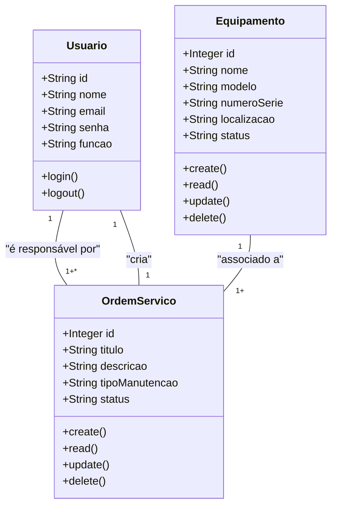

# Sistema de Gestão de Manutenção (Formativa)

# Briefing

## Visão Geral do Projeto
O projeto consiste no desenvolvimento de um Sistema de Gestão de Manutenção (SGM) no formato de uma aplicação web. O objetivo é centralizar e otimizar o controle das atividades de manutenção de máquinas e equipamentos de uma empresa. A plataforma permitirá o cadastro de equipamentos, agendamento de manutenções preventivas e corretivas, e o gerenciamento de ordens de serviço.


## Escopo

- ### Objetivos:
    - Centralizar Informações: Unificar os dados sobre equipamentos e manutenções em um único local.
    - Otimizar Processos: Agilizar a abertura, atribuição e finalização de ordens de serviço.
    - Melhorar a Tomada de Decisão: Fornecer um histórico detalhado de manutenções por equipamento para análises futuras.
    - Aumentar a Produtividade: Reduzir o tempo de inatividade dos equipamentos através de um gerenciamento mais eficaz.
    - Garantir a Segurança: Proteger o acesso e os dados do sistema com autenticação moderna e segura.

- ### Público-Alvo:
    - Técnicos de Manutenção: Responsáveis pela execução e atualização das ordens de serviço.
    - Gestores de Manutenção: Encarregados de planejar, delegar e supervisionar as atividades de manutenção.
    - Administradores do Sistema: Responsáveis pela gestão de usuários e permissões.

- ### Recursos Tecnológicos:


## Diagramas (Mermaid, Miro, Draw.io)

1. ### Diagrama de Classes
Este diagrama modela as principais entidades do sistema: Usuario (Usuário), Equipamento (Equipamento) e OrdemServico (Ordem de Serviço), mostrando seus atributos e os relacionamentos entre elas.



#### Explicação:
- Um Usuario (Técnico) pode ser responsável por várias OrdemServico (Ordens de Serviço).
-  Um Equipamento (Equipamento) pode estar associado a várias OrdemServico.
- Uma OrdemServico é criada por um Usuario (Gestor ou Administrador) e está associada a exatamente um equipamento e um técnico responsável.

2. ### Diagrama de Casos de Uso
Este diagrama ilustra as interações dos diferentes tipos de usuários (atores) com as funcionalidades do sistema.

```mermaid

graph TD
    subgraph Sistema de Gestão de Manutenção (SGM)
        uc1("Fazer Login")
        uc2("Gerenciar Equipamentos (CRUD)")
        uc3("Gerenciar Ordens de Serviço (CRUD)")
        uc4("Visualizar Dashboard")
        uc5("Gerenciar Usuários")
    end

    actor "Técnico de Manutenção" as Tecnico
    actor "Gestor de Manutenção" as Gestor
    actor "Administrador" as Admin

    Tecnico -- uc1
    Tecnico -- uc3
    Tecnico -- uc4

    Gestor -- uc1
    Gestor -- uc2
    Gestor -- uc3
    Gestor -- uc4

    Admin -- uc5
    Admin -- Gestor

    uc3 --|> uc1 : include
    uc2 --|> uc1 : include
    uc4 --|> uc1 : include
    uc5 --|> uc1 : include

```

#### Explicação:
- Atores: Técnico, Gestor e Administrador.

#### Casos de Uso:
- Técnico: Pode fazer login, gerenciar (visualizar e atualizar status) ordens de serviço e visualizar o dashboard.
- Gestor de Manutenção: Tem as mesmas permissões do técnico e, adicionalmente, pode gerenciar (criar, editar, excluir) equipamentos e ordens de serviço.
- Administrador: Herda as permissões do gestor e também pode gerenciar usuários.
- Relação include: Para acessar qualquer funcionalidade principal (gerenciar equipamentos, ordens, etc.), o usuário deve primeiro "Fazer Login".

3. ### Diagrama de Fluxo (Login e Acesso ao Dashboard)
Este diagrama detalha o processo passo a passo que um usuário segue para se autenticar no sistema e acessar o dashboard principal.

```mermaid

graph TD
    A[Início] --> B{Acessa a Tela de Login};
    B --> C[Preenche E-mail e Senha];
    C --> D{Clica em "Entrar"};
    D --> E{Sistema Valida Credenciais?};
    E -- Sim --> F[Gera Token JWT];
    F --> G[Armazena Token no Cliente];
    G --> H{Redireciona para o Dashboard};
    H --> I[Exibe Ordens de Serviço];
    I --> J[Fim];
    E -- Não --> K[Exibe Mensagem de Erro];
    K --> B;

```

#### Explicação:

- O fluxo começa quando o usuário acessa a tela de login.
- Ele insere suas credenciais (e-mail e senha).
- O sistema verifica se as credenciais são válidas.
    - Se sim: Um token de autenticação (JWT) é gerado, armazenado no navegador do cliente, e o usuário é redirecionado para o dashboard, onde os dados são exibidos.
    - Se não: Uma mensagem de erro é exibida, e o usuário permanece na tela de login para tentar novamente.

## Análise de Risco


## Prototipagem


## Codificação

